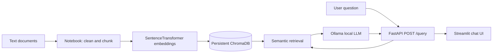

# AI, ML & Database RAG Assistant

A grounded Retrieval-Augmented Generation (RAG) web application that answers questions from a small educational corpus about Artificial Intelligence, Machine Learning, and Databases. It uses local embeddings, persistent ChromaDB retrieval, a local Ollama LLM, FastAPI, and Streamlit.

## Architecture



## Tech stack

- Python 3.10+
- PyPDF is not required for this text-corpus version; document loading uses UTF-8 text files
- SentenceTransformers: `sentence-transformers/all-MiniLM-L6-v2`
- ChromaDB persistent vector store
- Ollama local LLM (`llama3.2:3b` by default)
- FastAPI and Pydantic
- Streamlit
- Pytest

## Project structure

```text
notebooks/rag_pipeline.ipynb       # data preparation, retrieval experiments, evaluation
backend/app                         # FastAPI application
backend/data/vector_store           # generated by notebook; not committed
backend/tests/test_query.py         # health, valid request, invalid request tests
frontend/app.py                     # Streamlit chat interface
scripts/download_data.py            # downloads selected corpus
```

## Domain and data

The assistant uses three small educational text documents: `AI.txt`, `Machine_Learning.txt`, and `Database.txt`. Run the download script to obtain the corpus from the selected public repository. Verify you have permission to reuse the corpus and retain attribution to its source. The raw corpus is intentionally excluded from Git because data policies may differ by deployment.

## Setup

### 1. Create environment and install packages

```bash
python -m venv .venv
# Windows PowerShell
.venv\Scripts\Activate.ps1
# macOS/Linux
# source .venv/bin/activate
pip install -r backend/requirements.txt
pip install -r frontend/requirements.txt
```

### 2. Download data

```bash
python scripts/download_data.py
```

### 3. Configure Ollama

```bash
ollama pull llama3.2:3b
```

Copy `backend/.env.example` to `backend/.env`. Change `OLLAMA_MODEL` only if you pulled a different local model. Copy `frontend/.env.example` to `frontend/.env`.

### 4. Build vector store

```bash
jupyter notebook
```

Open and run `notebooks/rag_pipeline.ipynb` from top to bottom. It creates `backend/data/vector_store/` and `backend/data/vector_store/rag_config.json`.

### 5. Run backend

```bash
cd backend
uvicorn app.main:app --reload
```

Open `http://127.0.0.1:8000/docs`.

### 6. Run frontend

Open a second terminal from the project root:

```bash
cd frontend
streamlit run app.py
```

## Environment variables

| Variable | Used by | Default | Purpose |
|---|---|---|---|
| `OLLAMA_MODEL` | Backend | `llama3.2:3b` | Local Ollama model name |
| `OLLAMA_HOST` | Backend | `http://localhost:11434` | Ollama server address |
| `EMBEDDING_MODEL` | Backend/notebook | `sentence-transformers/all-MiniLM-L6-v2` | Embedding model |
| `TOP_K` | Backend | `4` | Number of retrieved chunks |
| `FRONTEND_ORIGIN` | Backend | `http://localhost:8501` | Allowed CORS origin |
| `API_BASE_URL` | Frontend | `http://localhost:8000` | FastAPI base URL |

## API reference

### `GET /health`

Returns backend status and whether the vector store service has loaded.

### `POST /query`

Request body:

```json
{"question": "What is supervised learning?"}
```

Response body:

```json
{"answer": "...", "sources": ["Machine_Learning.txt — chunk 2"]}
```

Example request:

```bash
curl -X POST "http://localhost:8000/query" \
  -H "Content-Type: application/json" \
  -d "{\"question\": \"What is supervised learning?\"}"
```

## Testing

```bash
cd backend
pytest -q
```

The tests include health status, a successful query, and invalid input returning HTTP 422.


## Limitations

- The corpus is small and restricted to three introductory documents.
- Retrieval quality depends on document wording and chunking choices.
- The LLM can only be as grounded as the retrieved context; the prompt includes a refusal instruction for unsupported questions.
- Screenshots of the running Streamlit app and Swagger endpoint should be added before submission.
